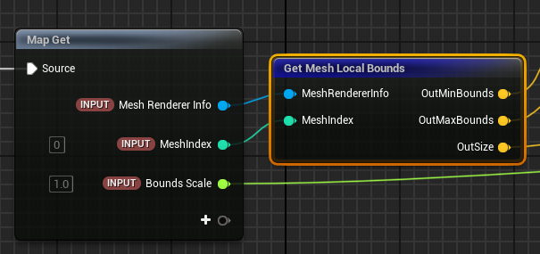
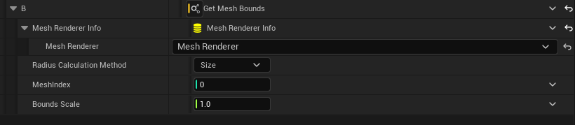
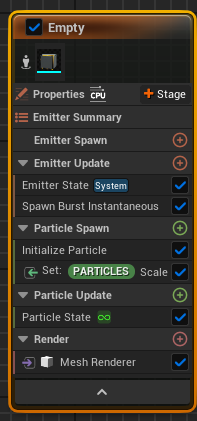
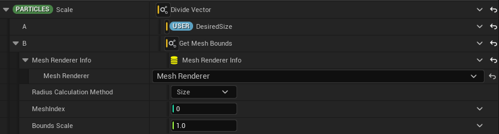
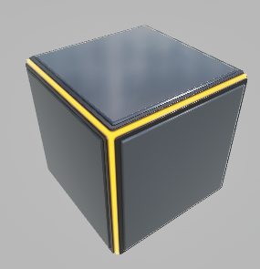

# Fit mesh scale to size
개밟 환경 : UE5, 나이아가라 파티클 시스템
### 히스토리
나이아가라는 메시 렌더러를 갖고 있다. Epic 레퍼런스 문서와 프로파일링 결과에 따르면 (PC 기준) 메시 파티클을 렌더링할 때에도 스프라이트의 경우와 같이 언리얼이 배칭(Batching)해줌을 확인할 수 있다. 따라서 퍼포먼스에 크게 신경쓰지 않고 메시를 활용한 다양한 FX를 구현할 수 있다. 또한 (당연하게도) 메시 렌더러에는 Scale 어트리뷰트를 지정할 수 있어 나이아가라 컴포넌트의 스케일에 의존하지 않고 파티클마다 다른 스케일을 적용할 수 있다.

그런데 느낌적인 느낌을 위한 스케일은 눈대중으로 결정할 수 있겠지만 FX의 사이즈가 게임플레이에 기능적으로 활용된다면 이야기가 조금 다르다. 이 때는 (외부에서 주어지는) 사이즈 값과 메시 렌더러가 그려내는 메시의 사이즈가 정확히 일치해야한다. 메시 파티클을 원하는 *사이즈*로 그려내기 위한 *스케일*을 쉽게 계산해보자.

### Mesh.Scale
화면에 최종 렌더링되는 메시의 사이즈는 아래와 같이 결정된다.

``렌더링 사이즈 = 메시의 디폴트 사이즈 * 파티클의 (Vec3)Scale 값``

이 때 Scale 값이 다음과 같다면 어떨까 : ``Scale  = (메시의 디폴트 사이즈 * 원하는 렌더링 사이즈)``

``렌더링 사이즈 = 메시의 디폴트 사이즈 / (메시의 디폴트 사이즈 * 원하는 렌더링 사이즈) = 원하는는 렌더링 사이즈``

이를 메시의 사이즈를 무조건 1로 만든 다음, 원하는 렌더링 사이즈를 곱해내는 것과 같다. 그렇다면 원하는 렌더링 사이즈를 얻기 위해서는 '메시의 디폴트 사이즈'를 얻어내면 된다.

### Get Mesh Local Bounds
나이아가라 시뮬레이션의 각 단계 에서 Mesh Renderer Info에 접근할 수가 있는데, 이를 통해 한 에미터에 등록된 메시 렌더러의 정보를 가져올 수 있다. 예를들면 Mesh Renderer Info에서 Get Mesh Local Bounds 노드를 통해 메시 렌더러에 할당된 스태틱 메시의 Bounds 정보를 가져오는 식이다. *Vec3*를 출력하는 Get Mesh Bounds 다이나믹 인풋도 함께 구현되어 있으니 이를 활용하면 메시 렌더러에 할당된 메시의 사이즈를 동적으로 손쉽게 가져올 수 있다.

*Get Mesh Local Bounds 스크래치 모듈*

*Get Mesh Bounds 다이나믹 인풋*

따라서 다음과 같은 간단한 세팅으로 User.DesiredSize에 정의된 값으로 큐브의 사이즈를 조절할 수 있다.

|     |     |  |
|:---:|:---:|:---:|